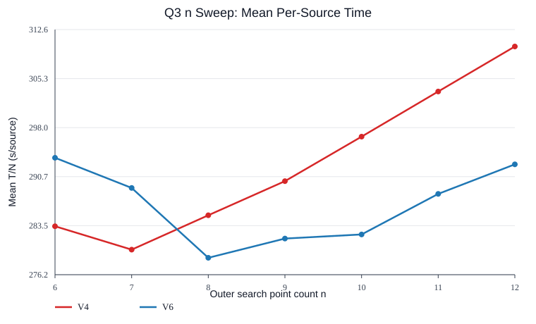
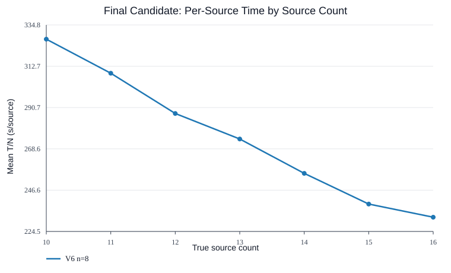

# Q3 Outer Search Point Count Sweep

This is an offline_sim/practice-only single-variable experiment. The only changed variable is the number of uniformly spaced outer SEARCH points `n`; V4/V6 policy logic, UNKNOWN scanning, FOUND supplement logic, routing, `MEC <= 20m`, candidate generation/scoring, and the 16-source early stop rule are left unchanged.

Seeds: random `0:100`, stress `10000:10050` for min_reff and collinear. Official HTTP/practice/formal endpoints were not called.

Primary metric: per episode `T_i / N_i`, then averaged as `MeanAvgSource = mean_i(T_i / N_i)`. This is not `mean(T)/mean(N)`.

## A. Design And Only Variable

Compared versions: `v4`, `v6`. Tested n values: 6, 7, 8, 9, 10, 11, 12. Radius uses the theoretical formula exactly: `a_n = 1800*cos(pi/n) - sqrt(1000^2 - 1800^2*sin(pi/n)^2)`.

The fixed scan proxy is `L_n/5 + 20*(n+1)*5 + 19*(n+1)`, i.e. all 20 channels at every SEARCH point with snake-like channel order. Actual policy time can be lower because FOUND channels leave UNKNOWN scanning and search can stop after 16 discovered sources.

## B. Theoretical Search Structure

| n | a_n m | L_n m | L_n/5 s | Full scan proxy s |
| --- | --- | --- | --- | --- |
| 6 | 1122.955832 | 6737.73 | 1347.55 | 2180.55 |
| 7 | 997.201346 | 6189.23 | 1237.85 | 2189.85 |
| 8 | 938.060414 | 5963.78 | 1192.76 | 2263.76 |
| 9 | 903.416263 | 5847.20 | 1169.44 | 2359.44 |
| 10 | 880.873733 | 5780.56 | 1156.11 | 2465.11 |
| 11 | 865.211072 | 5740.37 | 1148.07 | 2576.07 |
| 12 | 853.815565 | 5715.46 | 1143.09 | 2690.09 |

## C. V4 Summary By n

| n | ClearRate | Clear fail | Mean T | Median T | P95 T | Max T | Mean T/N | Median T/N | P95 T/N | Move m | Measure | Switch | CPU s |
| --- | --- | --- | --- | --- | --- | --- | --- | --- | --- | --- | --- | --- | --- |
| 6 | 100.0% | 0 | 3559.44 | 3597.63 | 4329.71 | 4857.65 | 283.37 | 282.86 | 355.15 | 14450.40 | 101.72 | 97.03 | 0.1965 |
| 7 | 100.0% | 0 | 3520.55 | 3543.00 | 4342.51 | 4922.25 | 279.90 | 283.20 | 348.20 | 13983.37 | 110.92 | 105.58 | 0.2183 |
| 8 | 100.0% | 0 | 3579.99 | 3605.04 | 4372.36 | 4886.33 | 285.01 | 286.19 | 362.51 | 13979.83 | 121.04 | 115.12 | 0.2324 |
| 9 | 100.0% | 0 | 3642.09 | 3709.33 | 4556.78 | 4819.12 | 290.07 | 290.74 | 365.69 | 14028.94 | 129.84 | 123.40 | 0.2485 |
| 10 | 100.0% | 0 | 3720.43 | 3802.64 | 4534.26 | 5184.91 | 296.68 | 295.01 | 382.49 | 14158.13 | 138.72 | 131.53 | 0.2557 |
| 11 | 100.0% | 0 | 3806.27 | 3917.44 | 4754.79 | 5099.59 | 303.38 | 307.01 | 388.78 | 14312.99 | 147.91 | 140.40 | 0.2613 |
| 12 | 100.0% | 0 | 3885.25 | 4044.48 | 4811.54 | 5124.81 | 310.07 | 311.05 | 408.26 | 14429.68 | 157.38 | 148.74 | 0.2683 |

## D. V6 Summary By n

| n | ClearRate | Clear fail | Mean T | Median T | P95 T | Max T | Mean T/N | Median T/N | P95 T/N | Move m | Measure | Switch | CPU s |
| --- | --- | --- | --- | --- | --- | --- | --- | --- | --- | --- | --- | --- | --- |
| 6 | 100.0% | 0 | 3687.95 | 3754.24 | 4576.34 | 5041.59 | 293.54 | 294.29 | 370.64 | 15061.67 | 102.80 | 97.92 | 1.1768 |
| 7 | 100.0% | 0 | 3629.23 | 3695.34 | 4511.17 | 4975.03 | 289.07 | 292.82 | 367.68 | 14519.65 | 111.11 | 106.05 | 1.3165 |
| 8 | 100.0% | 0 | 3496.69 | 3534.23 | 4244.83 | 4817.50 | 278.69 | 278.59 | 356.26 | 13554.13 | 121.31 | 115.58 | 1.5267 |
| 9 | 100.0% | 0 | 3528.63 | 3629.92 | 4343.48 | 5149.92 | 281.55 | 277.78 | 368.40 | 13458.95 | 129.91 | 123.59 | 1.7660 |
| 10 | 100.0% | 0 | 3534.73 | 3602.25 | 4406.10 | 4995.84 | 282.16 | 284.88 | 368.26 | 13215.71 | 139.22 | 131.79 | 1.8932 |
| 11 | 100.0% | 0 | 3609.97 | 3699.99 | 4447.30 | 4890.24 | 288.18 | 285.89 | 375.91 | 13314.87 | 148.49 | 140.88 | 2.1151 |
| 12 | 100.0% | 0 | 3664.83 | 3755.21 | 4553.27 | 5274.02 | 292.57 | 292.51 | 396.18 | 13321.26 | 157.66 | 148.57 | 2.0342 |

## E. Primary Mean(T/N) Comparison

Within the tested n range, V4 is best at n=7 with Mean(T/N)=279.90s/source. V6 is best at n=8 with Mean(T/N)=278.69s/source.

The best overall candidate within the tested n range is `v6/n=8` with Mean(T/N)=278.69s/source, mean total=3496.69s, P95(T/N)=356.26s/source, max total=4817.50s.

## F. Source Count Groups

Final candidate source-count curve: `v6/n=8`.

| N | Cases | Mean T | Mean T/N | Median T/N | P95 T/N |
| --- | --- | --- | --- | --- | --- |
| 10 | 23 | 3271.82 | 327.18 | 319.25 | 377.11 |
| 11 | 38 | 3399.02 | 309.00 | 306.93 | 381.97 |
| 12 | 34 | 3450.15 | 287.51 | 298.07 | 337.42 |
| 13 | 33 | 3560.58 | 273.89 | 278.20 | 326.93 |
| 14 | 34 | 3577.64 | 255.55 | 264.59 | 294.84 |
| 15 | 21 | 3587.48 | 239.17 | 248.09 | 283.14 |
| 16 | 17 | 3714.24 | 232.14 | 240.76 | 278.68 |

The grouped T/N trend need not be strictly monotone: fixed SEARCH cost is amortized over more sources, while the 16-source early stop can shorten UNKNOWN scanning when many true channels are discovered early.

Full version x n x source-count grouped table:

| Version | n | N | Cases | Mean T | Mean T/N | Median T/N | P95 T/N |
| --- | --- | --- | --- | --- | --- | --- | --- |
| v4 | 6 | 10 | 23 | 3325.55 | 332.56 | 343.46 | 376.96 |
| v4 | 6 | 11 | 38 | 3410.12 | 310.01 | 312.95 | 364.00 |
| v4 | 6 | 12 | 34 | 3483.92 | 290.33 | 285.61 | 344.11 |
| v4 | 6 | 13 | 33 | 3655.72 | 281.21 | 286.19 | 330.15 |
| v4 | 6 | 14 | 34 | 3624.88 | 258.92 | 266.61 | 304.01 |
| v4 | 6 | 15 | 21 | 3703.50 | 246.90 | 256.45 | 292.76 |
| v4 | 6 | 16 | 17 | 3864.96 | 241.56 | 252.42 | 285.86 |
| v4 | 7 | 10 | 23 | 3267.41 | 326.74 | 332.54 | 374.65 |
| v4 | 7 | 11 | 38 | 3351.60 | 304.69 | 308.45 | 350.36 |
| v4 | 7 | 12 | 34 | 3376.20 | 281.35 | 284.93 | 329.49 |
| v4 | 7 | 13 | 33 | 3600.91 | 276.99 | 284.82 | 332.59 |
| v4 | 7 | 14 | 34 | 3633.14 | 259.51 | 265.26 | 303.57 |
| v4 | 7 | 15 | 21 | 3759.17 | 250.61 | 262.49 | 298.92 |
| v4 | 7 | 16 | 17 | 3853.41 | 240.84 | 257.34 | 298.37 |
| v4 | 8 | 10 | 23 | 3385.46 | 338.55 | 333.12 | 394.58 |
| v4 | 8 | 11 | 38 | 3457.39 | 314.31 | 310.21 | 372.75 |
| v4 | 8 | 12 | 34 | 3452.60 | 287.72 | 289.80 | 345.98 |
| v4 | 8 | 13 | 33 | 3633.67 | 279.51 | 284.29 | 330.66 |
| v4 | 8 | 14 | 34 | 3620.16 | 258.58 | 267.73 | 295.41 |
| v4 | 8 | 15 | 21 | 3719.65 | 247.98 | 257.98 | 292.35 |
| v4 | 8 | 16 | 17 | 4014.94 | 250.93 | 261.90 | 296.21 |
| v4 | 9 | 10 | 23 | 3466.35 | 346.64 | 349.63 | 402.82 |
| v4 | 9 | 11 | 38 | 3486.84 | 316.99 | 324.56 | 371.53 |
| v4 | 9 | 12 | 34 | 3555.75 | 296.31 | 299.41 | 359.69 |
| v4 | 9 | 13 | 33 | 3693.81 | 284.14 | 286.50 | 350.68 |
| v4 | 9 | 14 | 34 | 3712.49 | 265.18 | 270.06 | 316.22 |
| v4 | 9 | 15 | 21 | 3782.20 | 252.15 | 265.47 | 304.37 |
| v4 | 9 | 16 | 17 | 3985.27 | 249.08 | 268.64 | 296.69 |
| v4 | 10 | 10 | 23 | 3576.27 | 357.63 | 363.38 | 411.92 |
| v4 | 10 | 11 | 38 | 3595.49 | 326.86 | 332.71 | 393.07 |
| v4 | 10 | 12 | 34 | 3645.48 | 303.79 | 314.69 | 359.00 |
| v4 | 10 | 13 | 33 | 3792.90 | 291.76 | 295.07 | 359.20 |
| v4 | 10 | 14 | 34 | 3739.83 | 267.13 | 276.29 | 312.59 |
| v4 | 10 | 15 | 21 | 3912.53 | 260.84 | 269.20 | 321.53 |
| v4 | 10 | 16 | 17 | 3927.88 | 245.49 | 257.99 | 294.80 |
| v4 | 11 | 10 | 23 | 3605.59 | 360.56 | 366.37 | 414.23 |
| v4 | 11 | 11 | 38 | 3697.83 | 336.17 | 346.77 | 398.67 |
| v4 | 11 | 12 | 34 | 3703.37 | 308.61 | 325.84 | 367.94 |
| v4 | 11 | 13 | 33 | 3907.04 | 300.54 | 310.61 | 367.28 |
| v4 | 11 | 14 | 34 | 3836.52 | 274.04 | 281.25 | 324.58 |
| v4 | 11 | 15 | 21 | 3990.97 | 266.06 | 282.36 | 323.08 |
| v4 | 11 | 16 | 17 | 4041.75 | 252.61 | 262.16 | 317.34 |
| v4 | 12 | 10 | 23 | 3739.41 | 373.94 | 385.09 | 437.93 |
| v4 | 12 | 11 | 38 | 3835.97 | 348.72 | 352.05 | 434.99 |
| v4 | 12 | 12 | 34 | 3760.53 | 313.38 | 330.90 | 364.68 |
| v4 | 12 | 13 | 33 | 3949.93 | 303.84 | 309.19 | 374.57 |
| v4 | 12 | 14 | 34 | 3911.92 | 279.42 | 293.52 | 328.58 |
| v4 | 12 | 15 | 21 | 4007.50 | 267.17 | 277.51 | 322.77 |
| v4 | 12 | 16 | 17 | 4112.21 | 257.01 | 270.12 | 315.72 |
| v6 | 6 | 10 | 23 | 3518.08 | 351.81 | 364.35 | 392.40 |
| v6 | 6 | 11 | 38 | 3502.41 | 318.40 | 324.47 | 370.95 |
| v6 | 6 | 12 | 34 | 3560.55 | 296.71 | 295.54 | 364.23 |
| v6 | 6 | 13 | 33 | 3733.10 | 287.16 | 299.49 | 357.82 |
| v6 | 6 | 14 | 34 | 3817.02 | 272.64 | 281.14 | 317.94 |
| v6 | 6 | 15 | 21 | 3845.38 | 256.36 | 261.00 | 307.38 |
| v6 | 6 | 16 | 17 | 4047.04 | 252.94 | 262.14 | 304.74 |
| v6 | 7 | 10 | 23 | 3403.33 | 340.33 | 348.22 | 390.17 |
| v6 | 7 | 11 | 38 | 3512.46 | 319.31 | 324.86 | 391.38 |
| v6 | 7 | 12 | 34 | 3507.62 | 292.30 | 299.97 | 345.14 |
| v6 | 7 | 13 | 33 | 3732.12 | 287.09 | 297.88 | 346.62 |
| v6 | 7 | 14 | 34 | 3725.25 | 266.09 | 273.60 | 325.68 |
| v6 | 7 | 15 | 21 | 3755.43 | 250.36 | 255.63 | 299.24 |
| v6 | 7 | 16 | 17 | 3891.40 | 243.21 | 246.70 | 297.01 |
| v6 | 8 | 10 | 23 | 3271.82 | 327.18 | 319.25 | 377.11 |
| v6 | 8 | 11 | 38 | 3399.02 | 309.00 | 306.93 | 381.97 |
| v6 | 8 | 12 | 34 | 3450.15 | 287.51 | 298.07 | 337.42 |
| v6 | 8 | 13 | 33 | 3560.58 | 273.89 | 278.20 | 326.93 |
| v6 | 8 | 14 | 34 | 3577.64 | 255.55 | 264.59 | 294.84 |
| v6 | 8 | 15 | 21 | 3587.48 | 239.17 | 248.09 | 283.14 |
| v6 | 8 | 16 | 17 | 3714.24 | 232.14 | 240.76 | 278.68 |
| v6 | 9 | 10 | 23 | 3413.75 | 341.37 | 338.10 | 404.67 |
| v6 | 9 | 11 | 38 | 3417.61 | 310.69 | 313.74 | 369.61 |
| v6 | 9 | 12 | 34 | 3479.29 | 289.94 | 303.57 | 337.95 |
| v6 | 9 | 13 | 33 | 3580.73 | 275.44 | 284.49 | 335.50 |
| v6 | 9 | 14 | 34 | 3560.70 | 254.34 | 264.97 | 293.77 |
| v6 | 9 | 15 | 21 | 3639.53 | 242.64 | 248.68 | 293.22 |
| v6 | 9 | 16 | 17 | 3728.61 | 233.04 | 235.41 | 311.17 |
| v6 | 10 | 10 | 23 | 3440.17 | 344.02 | 347.74 | 404.93 |
| v6 | 10 | 11 | 38 | 3453.18 | 313.93 | 316.73 | 372.54 |
| v6 | 10 | 12 | 34 | 3456.29 | 288.02 | 291.77 | 334.06 |
| v6 | 10 | 13 | 33 | 3615.85 | 278.14 | 284.02 | 340.60 |
| v6 | 10 | 14 | 34 | 3510.44 | 250.75 | 256.67 | 301.93 |
| v6 | 10 | 15 | 21 | 3629.33 | 241.96 | 245.15 | 300.47 |
| v6 | 10 | 16 | 17 | 3776.11 | 236.01 | 243.86 | 286.48 |
| v6 | 11 | 10 | 23 | 3465.32 | 346.53 | 350.39 | 391.43 |
| v6 | 11 | 11 | 38 | 3556.94 | 323.36 | 326.52 | 392.80 |
| v6 | 11 | 12 | 34 | 3543.44 | 295.29 | 311.90 | 345.34 |
| v6 | 11 | 13 | 33 | 3678.83 | 282.99 | 292.64 | 336.19 |
| v6 | 11 | 14 | 34 | 3621.39 | 258.67 | 269.09 | 303.73 |
| v6 | 11 | 15 | 21 | 3688.66 | 245.91 | 251.65 | 303.72 |
| v6 | 11 | 16 | 17 | 3803.63 | 237.73 | 253.46 | 287.41 |
| v6 | 12 | 10 | 23 | 3578.47 | 357.85 | 366.64 | 413.48 |
| v6 | 12 | 11 | 38 | 3567.98 | 324.36 | 327.99 | 394.08 |
| v6 | 12 | 12 | 34 | 3607.14 | 300.59 | 305.69 | 357.99 |
| v6 | 12 | 13 | 33 | 3715.16 | 285.78 | 290.88 | 347.61 |
| v6 | 12 | 14 | 34 | 3654.67 | 261.05 | 271.49 | 316.43 |
| v6 | 12 | 15 | 21 | 3802.84 | 253.52 | 276.21 | 304.44 |
| v6 | 12 | 16 | 17 | 3865.64 | 241.60 | 247.96 | 301.52 |

## G. Same-Seed Paired Comparison vs n=8

| Version | n | Win T/N | Mean dT | Mean dT/N | Median dT/N | P95 dT/N | Worst dT | >300s |
| --- | --- | --- | --- | --- | --- | --- | --- | --- |
| v4 | 6 | 56.0% | -20.55 | -1.63 | -3.40 | 35.81 | 802.67 | 22 |
| v4 | 7 | 59.5% | -59.44 | -5.11 | -3.58 | 25.43 | 762.51 | 14 |
| v4 | 9 | 39.5% | 62.10 | 5.06 | 4.51 | 34.80 | 929.47 | 36 |
| v4 | 10 | 27.0% | 140.44 | 11.67 | 9.88 | 46.94 | 786.90 | 46 |
| v4 | 11 | 17.0% | 226.28 | 18.38 | 19.07 | 54.20 | 956.33 | 74 |
| v4 | 12 | 11.0% | 305.26 | 25.06 | 24.71 | 71.09 | 1113.14 | 100 |
| v6 | 6 | 27.0% | 191.26 | 14.85 | 14.80 | 55.88 | 1312.15 | 66 |
| v6 | 7 | 29.0% | 132.54 | 10.37 | 13.05 | 42.35 | 1018.41 | 63 |
| v6 | 9 | 49.0% | 31.94 | 2.86 | 1.19 | 36.09 | 911.45 | 28 |
| v6 | 10 | 43.5% | 38.05 | 3.47 | 2.90 | 38.52 | 779.65 | 29 |
| v6 | 11 | 30.5% | 113.29 | 9.49 | 8.12 | 40.81 | 907.26 | 47 |
| v6 | 12 | 27.0% | 168.14 | 13.88 | 13.21 | 50.12 | 1127.72 | 62 |

## H. Phase Effects

| Version | n | Phase | Mean phase s | Move s | Measure s | Switch s | Clear s |
| --- | --- | --- | --- | --- | --- | --- | --- |
| v4 | 6 | search | 1218.92 | 732.07 | 407.20 | 79.64 | 0.00 |
| v4 | 6 | found | 1452.08 | 1333.27 | 101.42 | 17.39 | 0.00 |
| v4 | 6 | clear | 888.44 | 824.74 | 0.00 | 0.00 | 63.70 |
| v4 | 7 | search | 1237.89 | 700.78 | 449.38 | 87.74 | 0.00 |
| v4 | 7 | found | 1432.39 | 1309.33 | 105.22 | 17.84 | 0.00 |
| v4 | 7 | clear | 850.26 | 786.56 | 0.00 | 0.00 | 63.70 |
| v4 | 8 | search | 1359.50 | 764.49 | 498.18 | 96.83 | 0.00 |
| v4 | 8 | found | 1394.42 | 1269.10 | 107.03 | 18.30 | 0.00 |
| v4 | 8 | clear | 826.07 | 762.37 | 0.00 | 0.00 | 63.70 |
| v4 | 9 | search | 1450.16 | 807.73 | 538.20 | 104.23 | 0.00 |
| v4 | 9 | found | 1381.51 | 1251.34 | 111.00 | 19.17 | 0.00 |
| v4 | 9 | clear | 810.42 | 746.72 | 0.00 | 0.00 | 63.70 |
| v4 | 10 | search | 1523.21 | 829.00 | 582.05 | 112.16 | 0.00 |
| v4 | 10 | found | 1383.85 | 1252.95 | 111.53 | 19.37 | 0.00 |
| v4 | 10 | clear | 813.38 | 749.68 | 0.00 | 0.00 | 63.70 |
| v4 | 11 | search | 1599.10 | 850.36 | 627.70 | 121.05 | 0.00 |
| v4 | 11 | found | 1402.87 | 1271.64 | 111.88 | 19.36 | 0.00 |
| v4 | 11 | clear | 804.30 | 740.60 | 0.00 | 0.00 | 63.70 |
| v4 | 12 | search | 1671.93 | 871.77 | 671.55 | 128.61 | 0.00 |
| v4 | 12 | found | 1413.25 | 1277.80 | 115.33 | 20.12 | 0.00 |
| v4 | 12 | clear | 800.06 | 736.36 | 0.00 | 0.00 | 63.70 |
| v6 | 6 | search | 1283.67 | 795.29 | 408.43 | 79.95 | 0.00 |
| v6 | 6 | found | 1547.58 | 1424.05 | 105.58 | 17.96 | 0.00 |
| v6 | 6 | clear | 856.69 | 792.99 | 0.00 | 0.00 | 63.70 |
| v6 | 7 | search | 1389.04 | 852.74 | 448.65 | 87.65 | 0.00 |
| v6 | 7 | found | 1435.11 | 1309.81 | 106.90 | 18.40 | 0.00 |
| v6 | 7 | clear | 805.08 | 741.38 | 0.00 | 0.00 | 63.70 |
| v6 | 8 | search | 1523.09 | 931.02 | 496.15 | 95.92 | 0.00 |
| v6 | 8 | found | 1224.10 | 1094.01 | 110.42 | 19.66 | 0.00 |
| v6 | 8 | clear | 749.50 | 685.80 | 0.00 | 0.00 | 63.70 |
| v6 | 9 | search | 1589.14 | 950.23 | 535.65 | 103.26 | 0.00 |
| v6 | 9 | found | 1206.14 | 1071.91 | 113.90 | 20.33 | 0.00 |
| v6 | 9 | clear | 733.35 | 669.65 | 0.00 | 0.00 | 63.70 |
| v6 | 10 | search | 1659.06 | 968.27 | 579.83 | 110.96 | 0.00 |
| v6 | 10 | found | 1179.90 | 1042.79 | 116.28 | 20.83 | 0.00 |
| v6 | 10 | clear | 695.78 | 632.08 | 0.00 | 0.00 | 63.70 |
| v6 | 11 | search | 1759.83 | 1014.42 | 625.60 | 119.81 | 0.00 |
| v6 | 11 | found | 1148.69 | 1010.80 | 116.83 | 21.06 | 0.00 |
| v6 | 11 | clear | 701.46 | 637.76 | 0.00 | 0.00 | 63.70 |
| v6 | 12 | search | 1837.37 | 1039.78 | 670.17 | 127.42 | 0.00 |
| v6 | 12 | found | 1130.13 | 990.84 | 118.12 | 21.16 | 0.00 |
| v6 | 12 | clear | 697.33 | 633.63 | 0.00 | 0.00 | 63.70 |

## I/J/K. Best n And Recommendation

- V4 best n within the tested range: `n=7` by Mean(T/N).
- V6 best n within the tested range: `n=8` by Mean(T/N).
- Recommended Q3 candidate within the tested n range: `v6/n=8`.

This is an empirical offline_sim conclusion over the tested n range, not a mathematical global optimum.

## L. Can Q3 Algorithm Development End?

Yes: this sweep supports keeping the existing frozen V6/n=8 as the final offline candidate, because changing only n did not produce a better tested configuration under the primary Mean(T/N) metric and tail checks.
