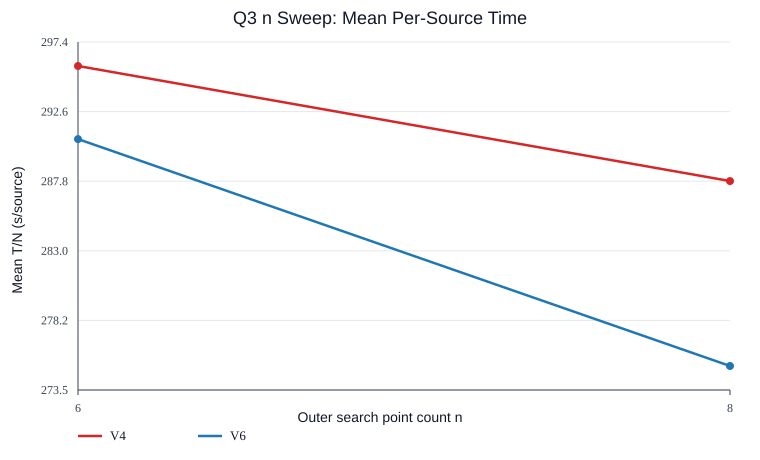
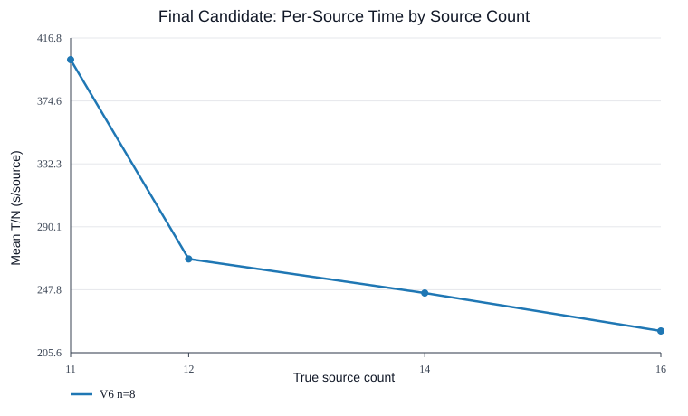

# Q3 Outer Search Point Count Sweep

This is an offline_sim/practice-only single-variable experiment. The only changed variable is the number of uniformly spaced outer SEARCH points `n`; V4/V6 policy logic, UNKNOWN scanning, FOUND supplement logic, routing, `MEC <= 20m`, candidate generation/scoring, and the 16-source early stop rule are left unchanged.

Seeds: random `0:2`, stress `10000:10002` for min_reff and collinear. Official HTTP/practice/formal endpoints were not called.

Primary metric: per episode `T_i / N_i`, then averaged as `MeanAvgSource = mean_i(T_i / N_i)`. This is not `mean(T)/mean(N)`.

## A. Design And Only Variable

Compared versions: `v4`, `v6`. Tested n values: 6, 8. Radius uses the theoretical formula exactly: `a_n = 1800*cos(pi/n) - sqrt(1000^2 - 1800^2*sin(pi/n)^2)`.

The fixed scan proxy is `L_n/5 + 20*(n+1)*5 + 19*(n+1)`, i.e. all 20 channels at every SEARCH point with snake-like channel order. Actual policy time can be lower because FOUND channels leave UNKNOWN scanning and search can stop after 16 discovered sources.

## B. Theoretical Search Structure

| n | a_n m | L_n m | L_n/5 s | Full scan proxy s |
| --- | --- | --- | --- | --- |
| 6 | 1122.955832 | 6737.73 | 1347.55 | 2180.55 |
| 8 | 938.060414 | 5963.78 | 1192.76 | 2263.76 |

## C. V4 Summary By n

| n | ClearRate | Clear fail | Mean T | Median T | P95 T | Max T | Mean T/N | Median T/N | P95 T/N | Move m | Measure | Switch | CPU s |
| --- | --- | --- | --- | --- | --- | --- | --- | --- | --- | --- | --- | --- | --- |
| 6 | 100.0% | 0 | 3826.08 | 3949.76 | 4310.12 | 4400.58 | 295.75 | 271.63 | 383.05 | 15742.07 | 102.83 | 97.67 | 0.1992 |
| 8 | 100.0% | 0 | 3710.40 | 3735.14 | 4613.86 | 4787.61 | 287.83 | 263.49 | 402.96 | 14707.02 | 118.17 | 112.33 | 0.2140 |

## D. V6 Summary By n

| n | ClearRate | Clear fail | Mean T | Median T | P95 T | Max T | Mean T/N | Median T/N | P95 T/N | Move m | Measure | Switch | CPU s |
| --- | --- | --- | --- | --- | --- | --- | --- | --- | --- | --- | --- | --- | --- |
| 6 | 100.0% | 0 | 3801.85 | 3791.77 | 4719.74 | 4834.41 | 290.72 | 292.95 | 363.04 | 15632.59 | 102.33 | 97.83 | 1.1275 |
| 8 | 100.0% | 0 | 3544.73 | 3586.30 | 4331.49 | 4424.82 | 275.11 | 261.09 | 377.74 | 13741.14 | 122.67 | 117.33 | 1.3757 |

## E. Primary Mean(T/N) Comparison

Within the tested n range, V4 is best at n=8 with Mean(T/N)=287.83s/source. V6 is best at n=8 with Mean(T/N)=275.11s/source.

The best overall candidate within the tested n range is `v6/n=8` with Mean(T/N)=275.11s/source, mean total=3544.73s, P95(T/N)=377.74s/source, max total=4424.82s.

## F. Source Count Groups

Final candidate source-count curve: `v6/n=8`.

| N | Cases | Mean T | Mean T/N | Median T/N | P95 T/N |
| --- | --- | --- | --- | --- | --- |
| 11 | 1 | 4424.82 | 402.26 | 402.26 | 402.26 |
| 12 | 2 | 3221.95 | 268.50 | 268.50 | 300.62 |
| 14 | 2 | 3438.70 | 245.62 | 245.62 | 285.02 |
| 16 | 1 | 3522.26 | 220.14 | 220.14 | 220.14 |

The grouped T/N trend need not be strictly monotone: fixed SEARCH cost is amortized over more sources, while the 16-source early stop can shorten UNKNOWN scanning when many true channels are discovered early.

## G. Same-Seed Paired Comparison vs n=8

| Version | n | Win T/N | Mean dT | Mean dT/N | Median dT/N | P95 dT/N | Worst dT | >300s |
| --- | --- | --- | --- | --- | --- | --- | --- | --- |
| v4 | 6 | 33.3% | 115.68 | 7.92 | 8.75 | 38.47 | 597.23 | 2 |
| v6 | 6 | 33.3% | 257.12 | 15.61 | 15.68 | 67.30 | 1312.15 | 2 |

## H. Phase Effects

| Version | n | Phase | Mean phase s | Move s | Measure s | Switch s | Clear s |
| --- | --- | --- | --- | --- | --- | --- | --- |
| v4 | 6 | search | 1413.21 | 920.21 | 412.50 | 80.50 | 0.00 |
| v4 | 6 | found | 1460.80 | 1341.96 | 101.67 | 17.17 | 0.00 |
| v4 | 6 | clear | 952.07 | 886.24 | 0.00 | 0.00 | 65.83 |
| v4 | 8 | search | 1385.70 | 813.20 | 479.17 | 93.33 | 0.00 |
| v4 | 8 | found | 1474.35 | 1343.68 | 111.67 | 19.00 | 0.00 |
| v4 | 8 | clear | 850.36 | 784.53 | 0.00 | 0.00 | 65.83 |
| v6 | 6 | search | 1289.15 | 803.82 | 405.83 | 79.50 | 0.00 |
| v6 | 6 | found | 1533.58 | 1409.42 | 105.83 | 18.33 | 0.00 |
| v6 | 6 | clear | 979.11 | 913.28 | 0.00 | 0.00 | 65.83 |
| v6 | 8 | search | 1570.13 | 975.46 | 498.33 | 96.33 | 0.00 |
| v6 | 8 | found | 1221.15 | 1085.15 | 115.00 | 21.00 | 0.00 |
| v6 | 8 | clear | 753.45 | 687.62 | 0.00 | 0.00 | 65.83 |

## I/J/K. Best n And Recommendation

- V4 best n within the tested range: `n=8` by Mean(T/N).
- V6 best n within the tested range: `n=8` by Mean(T/N).
- Recommended Q3 candidate within the tested n range: `v6/n=8`.

This is an empirical offline_sim conclusion over the tested n range, not a mathematical global optimum.

## L. Can Q3 Algorithm Development End?

Yes: this sweep supports keeping the existing frozen V6/n=8 as the final offline candidate, because changing only n did not produce a better tested configuration under the primary Mean(T/N) metric and tail checks.
